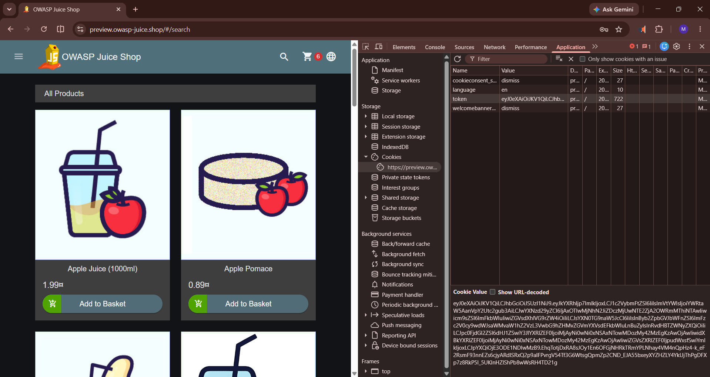
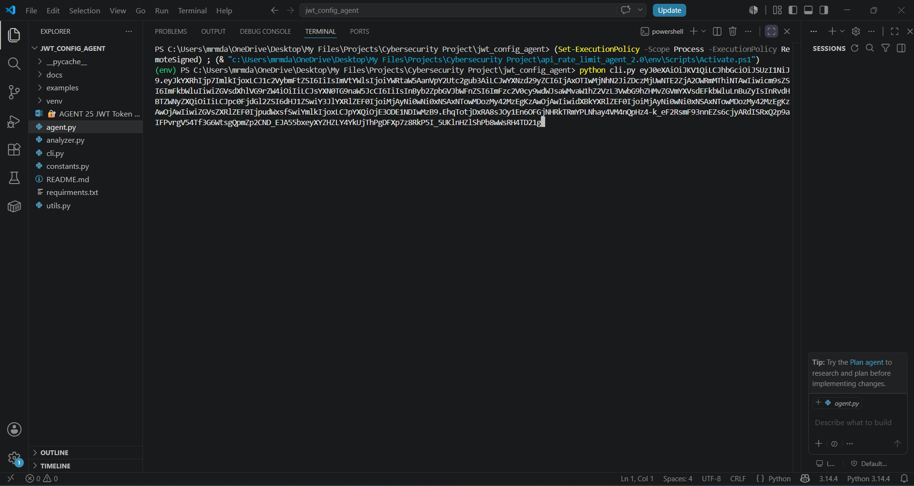
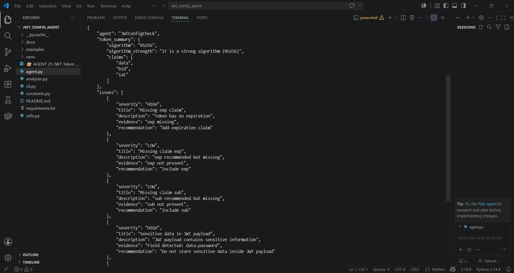

# JWT Configuration Analyzer

A Python-based security analysis tool that analyzes JSON Web Tokens (JWTs) and identifies common security misconfigurations, weak algorithms, missing claims, excessive expiration times, and sensitive data exposure.

## Features

* JWT structure validation
* Signature verification checks
* Algorithm security analysis
* Expiration claim validation
* Missing claim detection
* Sensitive data exposure detection
* Structured JSON reporting

## Supported Checks

### Header Analysis

* Missing algorithm detection
* Weak algorithm detection
* Detection of `alg=none`
* Algorithm classification

### Payload Analysis

* Missing `exp` claim
* Excessive token lifetime
* Missing recommended claims
* Sensitive information exposure

### Signature Analysis

* Missing signature detection
* Malformed token detection

## Project Architecture

Input JWT Token

↓

Decode Token

↓

Analyze Header

↓

Analyze Payload

↓

Analyze Signature

↓

Generate Security Report

---

## Screenshots

### JWT Extraction from OWASP Juice Shop



### Tool Execution



### Security Findings Output




## Example Usage

```bash
python cli.py <jwt_token>
```

## Example Output

```json
{
  "agent": "JWTConfigCheck",
  "token_summary": {
    "algorithm": "RS256"
  },
  "issues": []
}
```

## Technologies Used

* Python
* JSON
* Base64URL Decoding
* JWT Security Concepts

## Author

Mohammed Abdulrahman
Cybersecurity | VAPT | Security Automation
